# hdldiagZero

An agent skill that turns an HDL / RTL / SoC architecture description into a clean SVG block diagram. Color-codes blocks by clock domain, distinguishes AXI variants, draws CDC blocks with a split fill, omits clock / reset / JTAG / debug clutter by default, and validates the output geometry so lines never pass through blocks.

The skill is packaged as a Claude Code plugin: the runtime files live under [skills/hdldiagzero/](skills/hdldiagzero/) and are described by [.claude-plugin/plugin.json](.claude-plugin/plugin.json) and [.claude-plugin/marketplace.json](.claude-plugin/marketplace.json). Claude Code users install via the marketplace flow; other agent runtimes (Codex, custom) can use [install.py](install.py) for a direct copy.

## Index

- [Usage](#usage)
- [Sample Output](#sample-output)
- [Features](#features)
- [Files](#files)
- [Install](#install)
- [Testing](#testing)
- [Author](#author)
- [License](#license)

## Usage

Once installed, ask the agent something like *"draw the top-level RTL"* in any HDL project and the skill activates. By default it uses the light theme and depth 1 (top + direct children); add "dark mode" or "two levels deep" to override. The agent extracts the architecture, writes a JSON spec next to the SVG, validates the spec, runs the renderer, and validates the SVG geometry.

You can also drive the toolchain manually:

```
python validate_spec.py spec.json
python render.py --theme dark spec.json out.svg
python validate.py out.svg
```

Each validator exits 0 on PASS and a non-zero count of violations otherwise; each violation prints with coordinates so the agent (or a human) can adjust the JSON.

## Sample Output

### Hierarchy depth 1 - top + direct children

Generated from [test_spec.json](test_spec.json):

Light mode:

<a href="sample_output.svg">
  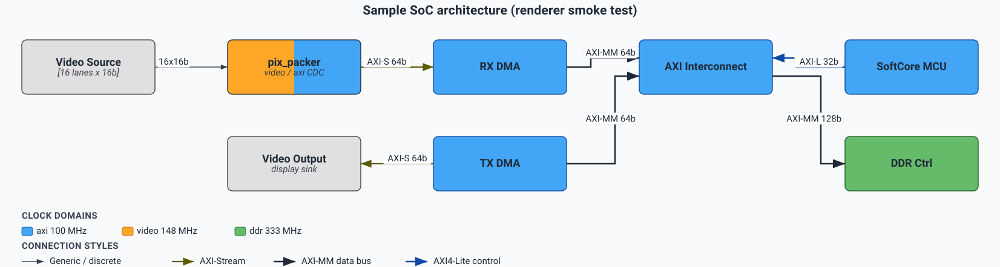
</a>

Dark mode:

<a href="sample_output_dark.svg">
  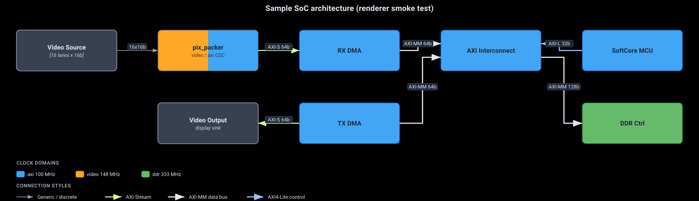
</a>

### Full SoC top-level

Generated from [test_spec_soc.json](test_spec_soc.json) - application SoC with a CPU complex, L2 cache (CDC), AXI interconnect, on-chip SRAM, DMA, DDR controller, off-chip DDR4, APB bridge, and an APB peripherals subsystem across four clock domains (cpu / axi / ddr / apb):

Light mode:

<a href="sample_soc.svg">
  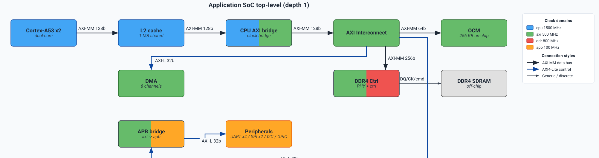
</a>

Dark mode:

<a href="sample_soc_dark.svg">
  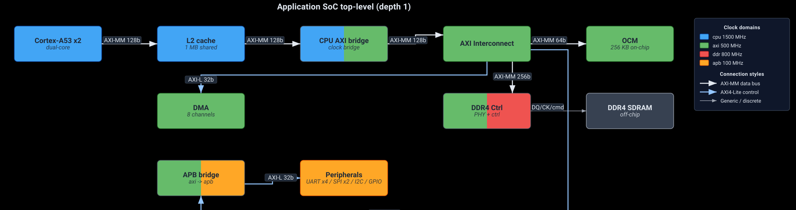
</a>

### OpenTitan Earl Grey sample

Generated from [test_spec_opentitan.json](test_spec_opentitan.json) - an overview-style sample of the OpenTitan Earl Grey SoC with Ibex, TL-UL fabric, memory controllers, secure services, peripheral fabric, interrupts, and always-on control paths:

Light mode:

<a href="sample_opentitan.svg">
  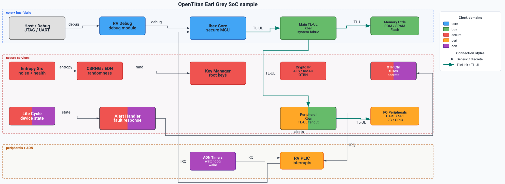
</a>

Dark mode:

<a href="sample_opentitan_dark.svg">
  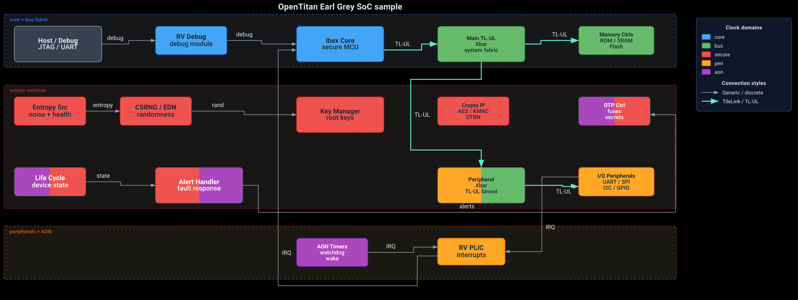
</a>

### OpenTitan Earl Grey depth 2

Generated from [test_spec_opentitan_depth2.json](test_spec_opentitan_depth2.json) - the same SoC expanded into grouped secure-services and peripheral-subsystem blocks:

Light mode:

<a href="sample_opentitan_depth2.svg">
  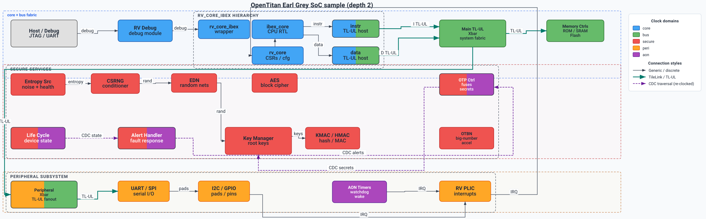
</a>

Dark mode:

<a href="sample_opentitan_depth2_dark.svg">
  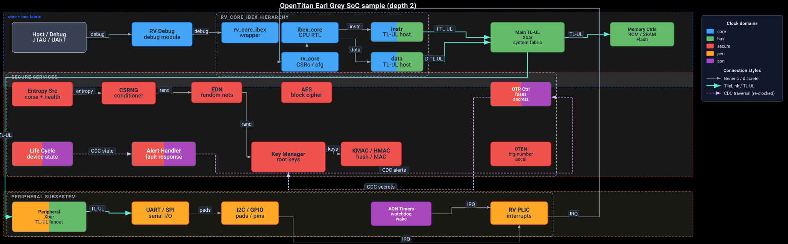
</a>

### Clock-domain lanes

Generated from [test_spec_lanes.json](test_spec_lanes.json) - an RHS-style acquisition pipeline where each clock domain gets its own tinted lane spanning the canvas:

Light mode:

<a href="sample_lanes.svg">
  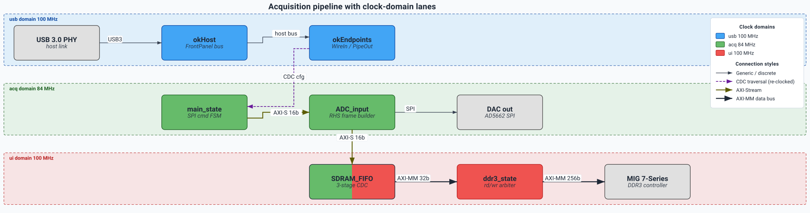
</a>

Dark mode:

<a href="sample_lanes_dark.svg">
  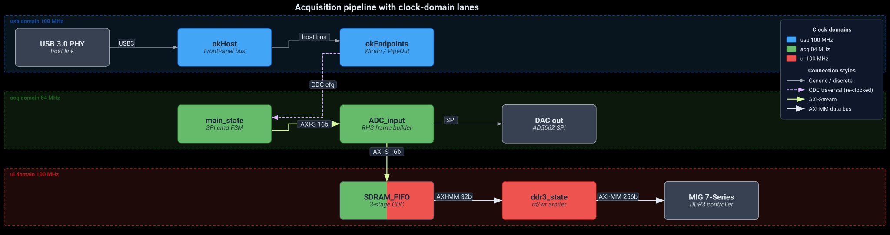
</a>

### Hierarchy depth 2 - children + grandchildren

Generated from [test_spec_depth2.json](test_spec_depth2.json) - a GbE MAC where the TX/RX paths are expanded into their internal descriptor -> FIFO/CDC -> MAC pipelines:

Light mode:

<a href="sample_depth2.svg">
  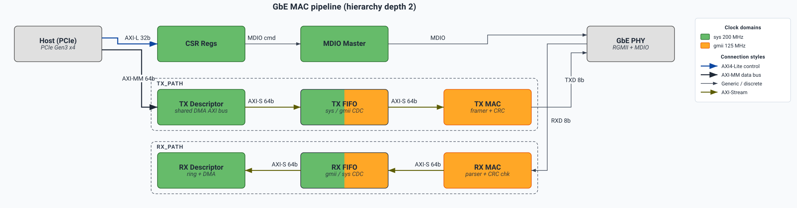
</a>

Dark mode:

<a href="sample_depth2_dark.svg">
  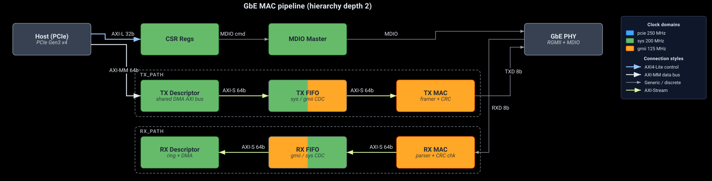
</a>

## Features

- **JSON-spec-driven render**: the agent extracts a small architecture spec; the renderer (`render.py`) produces the SVG. The renderer owns geometry - the agent doesn't pick coordinates.
- **Clock-domain coloring** with a tuned Material-tone palette. Each domain has a separate fill and dark border. CDC blocks (`domain_b: ...`) render with a horizontal-split linear gradient bridging two domains.
- **External / off-chip blocks** (`external: true`) get a neutral grey fill regardless of domain.
- **Edge-side external blocks** with optional `side` hints (`left`, `right`, `top`, `bottom`) so I/O blocks can sit on canvas edges and expose inward-facing ports.
- **Per-block sizing** with optional `w` / `h` overrides for compact leaves or larger hub blocks, while `grid.cell_w` / `grid.cell_h` remain the diagram-wide defaults.
- **Quarter-step placement** with `row` / `col` values like `1.25` or `2.5` for pulling related blocks closer together without compressing the whole diagram.
- **Compact multi-line block labels** with `lines: [...]` for dense SoC diagrams where `label` + `sublabel` is too rigid.
- **Functional background bands** (`bands`) and clock-domain lanes (`lanes`) for broad visual grouping, plus `legend: false` / `legend: compact` when large diagrams should spend the canvas on architecture instead of keys.
- **Explicit extraction policy** (`extraction.hide_primitives`, `hide_processor_structure`, `hide_debug`, `hide_clock_reset`) so clean architecture defaults can be overridden for implementation-detail diagrams.
- **Edge styles per kind**: `axi-mm`, `axi-lite`, `axi-stream`, `cdc` (purple dashed), `generic`. Distinct strokes and arrowheads, plus a connection-styles legend below the clock-domain legend.
- **Manhattan single-bend routing** with **interval-coloring lane assignment**: parallel edges sharing a gutter that *actually* overlap in y/x get distinct lanes; non-overlapping edges share a lane so labels stay in the gutter midpoint.
- **Row/column gutter detours** for same-row or same-column edges that need to pass around intermediate blocks.
- **WCAG-style text contrast**: block text auto-flips between light and dark by relative-luminance contrast so labels read on every fill, including CDC gradients.
- **Light + dark themes** (`theme: dark` in the JSON or `--theme dark` on the CLI). Dark mode uses pure black canvas with brightened accent colors for arrows, labels, and external blocks.
- **Edge bitwidth labels** at the bend midpoint, with a subtle pill mask so the line doesn't pierce the text.
- **Geometry validator** (`validate.py`) catches line-through-block crossings, parallel-arrow collisions, unnecessary route loops, stub arrows (shaft shorter than arrowhead), tangential block entry/exit, labels overlapping foreign blocks, arrows piercing other arrows' labels, multiple endpoints meeting at the same block port, and missing edge labels.

## Files

### Plugin runtime (installed into the agent's skill directory)

All runtime files live under [`skills/hdldiagzero/`](skills/hdldiagzero/) - the plugin shape Claude Code expects. `install.py` mirrors this directory into the destination, so a manual install ends up with the same files in the same relative layout.

| File | Purpose |
| --- | --- |
| [skills/hdldiagzero/SKILL.md](skills/hdldiagzero/SKILL.md) | Skill definition consumed by the agent runtime (description, workflow). |
| [skills/hdldiagzero/LICENSE](skills/hdldiagzero/LICENSE) | MIT license bundled with the runtime. |
| [skills/hdldiagzero/agents/openai.yaml](skills/hdldiagzero/agents/openai.yaml) | Marketplace/UI metadata for skill lists and default prompts. |
| [skills/hdldiagzero/assets/hdldiagzero-small.svg](skills/hdldiagzero/assets/hdldiagzero-small.svg) | Small icon used by marketplace/UI metadata. |
| [skills/hdldiagzero/render.py](skills/hdldiagzero/render.py) | JSON -> SVG renderer. |
| [skills/hdldiagzero/validate.py](skills/hdldiagzero/validate.py) | SVG geometry validator (exit code = violation count). |
| [skills/hdldiagzero/validate_spec.py](skills/hdldiagzero/validate_spec.py) | JSON spec validator - run before the renderer to catch structural errors. |
| [skills/hdldiagzero/references/schema.md](skills/hdldiagzero/references/schema.md) | Full JSON schema, loaded on demand. |
| [skills/hdldiagzero/references/extraction.md](skills/hdldiagzero/references/extraction.md) | HDL extraction patterns: top discovery, hierarchy walking, exclusions, AXI classification. |
| [skills/hdldiagzero/references/validation.md](skills/hdldiagzero/references/validation.md) | Fix recipes for each validator violation. |

### Plugin / marketplace metadata

| File | Purpose |
| --- | --- |
| [.claude-plugin/plugin.json](.claude-plugin/plugin.json) | Plugin manifest (name, version, author, license, repository). Claude Code reads this when installing. |
| [.claude-plugin/marketplace.json](.claude-plugin/marketplace.json) | Marketplace manifest. Lets the same repo also serve as a one-plugin marketplace; users add it with `/plugin marketplace add lcapossio/hdldiagZero`. |

### Repo-only (not in the plugin runtime)

| File | Purpose |
| --- | --- |
| [install.py](install.py) | Direct (non-marketplace) install path: copies `skills/hdldiagzero/` into a destination dir. Claude defaults; override with `--dst` for Codex / custom runtimes. |
| [tests.py](tests.py) | Self-tests: validators, renderer light + dark, install dry-run. |
| [test_spec.json](test_spec.json) | Clean renderer smoke-test spec (hierarchy depth 1 - top + direct children). |
| [test_spec_depth2.json](test_spec_depth2.json) | Depth-2 sample spec (GbE MAC with TX/RX pipelines expanded). |
| [test_spec_lanes.json](test_spec_lanes.json) | Clock-domain lanes sample (RHS-style acquisition pipeline). |
| [test_spec_soc.json](test_spec_soc.json) | Full SoC top-level sample (CPU + IC + DMA + DDR + APB peripherals). |
| [test_spec_opentitan.json](test_spec_opentitan.json) | OpenTitan Earl Grey overview sample. |
| [test_spec_opentitan_depth2.json](test_spec_opentitan_depth2.json) | OpenTitan Earl Grey depth-2 grouped sample. |
| [sample_output.svg](sample_output.svg) / [sample_output_dark.svg](sample_output_dark.svg) | Tracked light/dark renderer output from `test_spec.json`. |
| [sample_depth2.svg](sample_depth2.svg) / [sample_depth2_dark.svg](sample_depth2_dark.svg) | Tracked light/dark renderer output from `test_spec_depth2.json`. |
| [sample_lanes.svg](sample_lanes.svg) / [sample_lanes_dark.svg](sample_lanes_dark.svg) | Tracked light/dark renderer output from `test_spec_lanes.json`. |
| [sample_soc.svg](sample_soc.svg) / [sample_soc_dark.svg](sample_soc_dark.svg) | Tracked light/dark renderer output from `test_spec_soc.json`. |
| [sample_opentitan.svg](sample_opentitan.svg) / [sample_opentitan_dark.svg](sample_opentitan_dark.svg) | Tracked light/dark renderer output from `test_spec_opentitan.json`. |
| [sample_opentitan_depth2.svg](sample_opentitan_depth2.svg) / [sample_opentitan_depth2_dark.svg](sample_opentitan_depth2_dark.svg) | Tracked light/dark renderer output from `test_spec_opentitan_depth2.json`. |
| [not_sample_broken_validator_fixture.svg](not_sample_broken_validator_fixture.svg) | Intentionally broken validator regression fixture. It is supposed to fail with exactly 8 violations; it is not sample output. |
| [pyproject.toml](pyproject.toml) | Ruff lint config. |
| [.github/workflows/ci.yml](.github/workflows/ci.yml) | GitHub Actions: ruff + `python tests.py` on Linux / macOS / Windows x Python 3.10, 3.12. |
| [LICENSE](LICENSE), [README.md](README.md) | Repo-root license and docs (the plugin runtime carries its own copy of LICENSE under `skills/hdldiagzero/`). |

## Install

### Claude Code (recommended)

```
/plugin marketplace add lcapossio/hdldiagZero
/plugin install hdldiagzero@hdldiag-marketplace
```

Claude Code clones the repo, reads [.claude-plugin/marketplace.json](.claude-plugin/marketplace.json), and mounts [skills/hdldiagzero/](skills/hdldiagzero/) as the active skill. Restart Claude Code afterward.

### Other runtimes (Codex, custom)

Requires Python 3.10+. From the repo root:

```
python install.py                                # Claude Code direct copy: ~/.claude/skills/hdldiagzero
python install.py --runtime codex                # Codex default: ~/.codex/skills/hdldiagzero
python install.py --dst /opt/agent-skills/hdldiagzero
```

Copies the contents of [skills/hdldiagzero/](skills/hdldiagzero/) into the destination directory. Restart your runtime.

## Testing

```
python tests.py
```

Runs the same checks as CI:

1. **Validator regression** - runs `validate.py` on the intentionally broken `not_sample_broken_validator_fixture.svg` and asserts exactly 8 violations.
2. **Spec validator** - confirms `validate_spec.py` accepts a known-good spec and rejects one with an unknown block id in an edge.
3. **Renderer light + dark** - renders `test_spec.json` in both themes; each output passes geometry validation.
4. **Install dry-run** - copies the runtime files into a throwaway dir, asserts every runtime file is present, and asserts repo-only files (README, tests, fixtures) were *not* copied.

Test conditions: pure Python stdlib, no external tools, runs in well under 10 s on any modern machine. Verified on the OS / Python matrix in [.github/workflows/ci.yml](.github/workflows/ci.yml) (Linux / macOS / Windows x Python 3.10 / 3.12).

If your system temp dir isn't writable (locked-down corporate Windows, sandboxed runner, etc.), tests fall back to `<repo>/tmp/` (gitignored). Override the location with the env var `HDLDIAG_TEST_TMP=/path/of/your/choice`.

## Author

Leonardo Capossio - [bard0 design](https://www.bard0.com) - hello@bard0.com

## License

[MIT](LICENSE).
